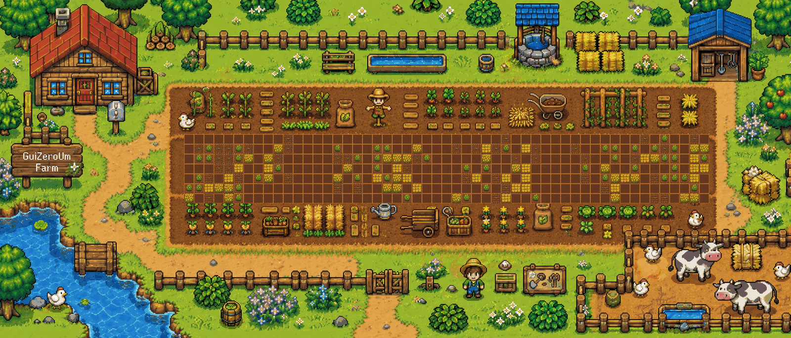

  

  🌱 Cada terreno representa um dia: terra arada significa nenhuma contribuição, enquanto o trigo cresce conforme a atividade aumenta. Atualizado automaticamente todos os dias.

<h1 align="center">Olá, eu sou o Guilherme Santos 👋</h1>

  Desenvolvedor Full Stack focado em criar <strong>produtos SaaS</strong>, <strong>automações</strong> e <strong>sistemas de gestão</strong> que resolvem problemas reais.

  
  
  

## 👨‍💻 Sobre mim

Atuo no desenvolvimento de aplicações web completas, da modelagem e das regras de negócio até interfaces responsivas e deploy. Tenho experiência profissional com **Python e Django** e atualmente também trabalho com **PHP e Laravel**, além de desenvolver interfaces com **Vue, React e Tailwind CSS**.

Meu foco está em arquitetura sustentável, código limpo, integrações e produtos que possam crescer como SaaS — especialmente plataformas multi-tenant, sistemas clínicos, CRMs e automações de processos.

## 🚜 O que estou construindo

- **Sistemas SaaS multi-tenant**, com isolamento de dados, planos, permissões e cobrança recorrente.
- **Plataformas de gestão clínica**, integrando agenda, pacientes, prontuário, financeiro, Google Calendar e WhatsApp.
- **Automações empresariais**, reduzindo tarefas manuais e transformando processos repetitivos em fluxos supervisionados.
- **Interfaces modernas**, responsivas e orientadas à experiência real de uso.

## 🧰 Tecnologias

  

## 🌾 Como funciona esta fazenda

A área central da arte é um calendário real de **53 semanas × 7 dias**. O workflow consulta suas contribuições pelo GitHub GraphQL, converte cada nível de atividade em um estágio da plantação e redesenha a fazenda automaticamente:

| Atividade no dia | Representação |
|:--|:--|
| Nenhuma contribuição | Terra arada |
| Baixa atividade | Pequeno broto |
| Atividade moderada | Plantação jovem |
| Alta atividade | Trigo verde desenvolvido |
| Atividade muito alta | Trigo dourado pronto para colheita |

O gerador, o workflow e toda a lógica visual estão disponíveis neste próprio repositório de perfil.

  <em>Construindo um pouco todos os dias — uma contribuição, uma colheita. 🌾</em>

